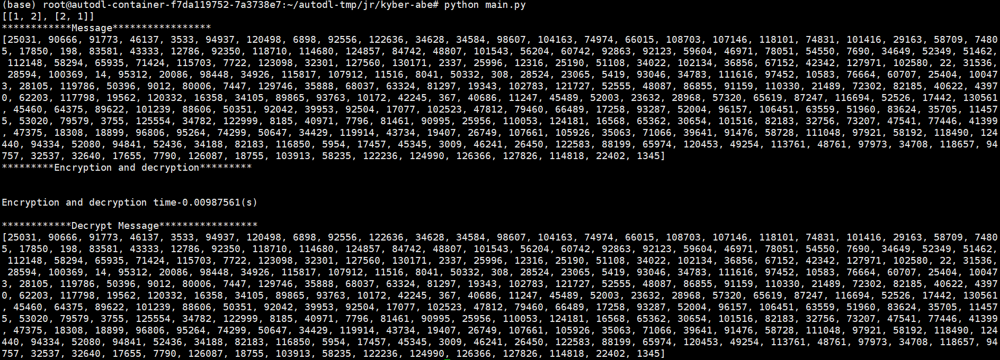

# ML-ABE

## Introduction

This repository is a demo for verifying the correctness of Paper ML-ABE: Computational Overhead and Efficiency Optimal Module Lattice-Based Attribute-Based Encryption submitted to CCS. This demo implements the core innovations of the paper, including the M-LWE algorithm and small matrix operations, aiming to showcase the practical effectiveness of our approach.

## Features

- **Demonstration of Core Innovations**: Integrates key technologies such as the M-LWE algorithm and small matrix operations, truly reflecting the innovativeness of the paper.
- **Excellent Performance**: The demo highlights the decryption process, which runs in approximately 10ms, efficiently demonstrating the practicality of the algorithm.
- **Lightweight Verification**: This demo concentrates on the fundamental functionalities proposed in the paper, such as encryption and decryption processes.

## Instructions

1. **Environment Preparation**: Please ensure that you have Python 3.11 installed along with the following packages:
   * numpy 1.26.2
   * math (built-in Python module)
   * random (built-in Python module)
2. **Compilation and Execution**: Follow the instructions provided in the project to compile and run the demo program.
3. **Viewing Results**: Upon running the program, key information, including decryption time, will be displayed to verify the performance of the algorithm.

## Open Source and Publication Plans

Please note that this demo serves solely as a tool for verifying the correctness of the algorithms and techniques detailed in our academic paper, "Computational Overhead and Efficiency Optimal Module Lattice-Based Attribute-Based Encryption" (abbreviated as ML-ABE in this readme). We anticipate that the full version of ML-ABE will accompany the submission of our camera-ready paper. We anticipate that the complete project will be made public upon the official publication of the paper or the approval of the open source application. Thank you for your patience, stay tuned for further updates!

## Disclaimer

- This demo is solely for academic exchange and verification purposes and should not be used for commercial use.
- Please comply with relevant laws, regulations, and open source agreements when using this demo.
